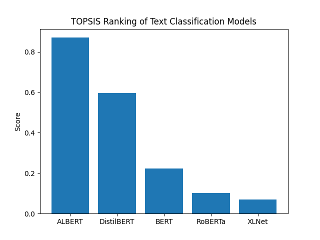

# TOPSIS-Based Selection of Best Pre-trained Model for Text Classification

## Student Details
**Name:** Ishita Oberoi  
**Roll Number:** 102317272  
**Task:** Text Classification (Roll numbers ending with 2 or 7)

---

# Objective
The objective of this project is to identify the most suitable pre-trained NLP model for text classification using the **TOPSIS (Technique for Order Preference by Similarity to Ideal Solution)** multi-criteria decision-making method.

---

# Models Evaluated
The following transformer-based pre-trained models were evaluated:

- BERT  
- DistilBERT  
- RoBERTa  
- ALBERT  
- XLNet  

These models represent diverse trade-offs between accuracy, computational cost, and model size.

---

# Evaluation Criteria
Models were compared using the following criteria:

| Criterion | Type | Description |
|----------|------|------------|
Accuracy | Benefit | Classification performance |
F1-score | Benefit | Balanced performance |
Inference Time | Cost | Prediction speed |
Model Size | Cost | Storage requirement |
Parameter Count | Cost | Model complexity |

---

# Criteria Weights
Weights were assigned based on importance in practical NLP deployment:

| Criterion | Weight |
|----------|--------|
Accuracy | 0.30 |
F1-score | 0.25 |
Inference Time | 0.15 |
Model Size | 0.15 |
Parameters | 0.15 |

---

# Methodology — TOPSIS Steps
1. Construct decision matrix  
2. Normalize the matrix  
3. Apply criteria weights  
4. Determine ideal best and worst solutions  
5. Compute distances to ideal solutions  
6. Calculate TOPSIS score  
7. Rank models  

---

# Results

| Rank | Model | TOPSIS Score |
|------|------|-------------|
1 | ALBERT | 0.870687 |
2 | DistilBERT | 0.596242 |
3 | BERT | 0.222497 |
4 | RoBERTa | 0.100950 |
5 | XLNet | 0.069425 |

---

# Best Model
According to the TOPSIS ranking, **ALBERT** achieved the highest score and is identified as the most suitable pre-trained model for text classification considering both performance and efficiency.

---

# Visualization
The TOPSIS scores of all models are visualized in the bar chart below.

---

# Conclusion
TOPSIS effectively evaluates multiple NLP models by considering both performance and computational efficiency.  
The analysis shows that **ALBERT provides the best balance between accuracy, speed, and model size**, making it the optimal choice for text classification among the evaluated models.

---

